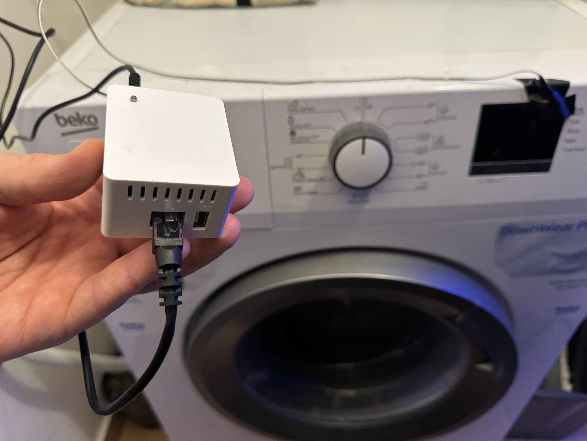
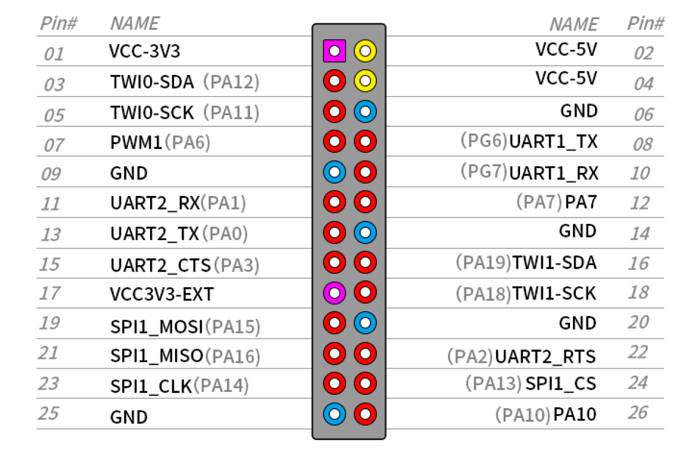

# Laundry Alert

> _A small IoT project that monitors your washing machine and sends a push notification when the washing cycle ends_
<br>



## How it works


The application consists of three parts

**PWA application**

A simple web application that is used to subscribe for notifications. It is installed on a phone as a web app.

Deployed at [laundry.iot.jozefcipa.com](https://laundry.iot.jozefcipa.com/).

See the [docs](./src/web/README.md).

**Control Unit**

This is where the main logic resides. It is an [OrangePi Zero](http://www.orangepi.org/html/hardWare/computerAndMicrocontrollers/details/Orange-Pi-Zero.html
) single-board computer running the Node.js app that communicates with the A/D converter, controls the status LED and sends push notifications to the web app.

Deployed at local network IP (e.g. `192.168.0.100:80`) behind the NGINX proxy.

See the [docs](./src/api/README.md).

**A/D converter**

[Seeeduino XIAO SAMD21](https://www.seeedstudio.com/Seeeduino-XIAO-Arduino-Microcontroller-SAMD21-Cortex-M0+-p-4426.html) is used here to perform a simple analog to digital conversion when reading the values from the photoresistor. This data is then processed by the Control unit.


See the [docs](./src/ad-converter/README.md).


## Running locally
- Install dependencies - `make deps`
- Start the web - `make web`
- Start the API - `make api/dev` (**Note**: the API must be [configured first](./src/api/README.md))
- Deploy the code to Seeduino (via Arduino IDE)

### Makefile - TBD
- list of commands


## Configuration

### OrangePi Configuration

#### Connecting to the unit
You can connect to OrangePi via SSH (password `orangepi`)

```bash
$ ssh orangepi@192.168.0.100
```

#### Installation

##### Prerequisites
> Make sure to have `mkcert` installed locally and generate the root CA authority first!
>
> https://github.com/FiloSottile/mkcert

- Install Node.js
- Install NPM dependencies (`make deps/prod`)
- Install [WiringOP](https://github.com/orangepi-xunlong/wiringOP) GPIO library
- Generate VAPID keys (See [API configuration](./src/api/README.md))
- Copy code from the computer - `make deploy`
- Start the API - `make api/prod`
- Register the API to start after booting - `make api/register-launcher`
  - Run the command provided in the output
- Install Nginx
- Generate SSL certificates - `make ssl/generate`
- Configure Nginx - `make nginx/setup`
- Open 192.168.0.100 in your browser. If everything went well you should see a response from the API.

#### GPIO
GPIO stands for General Purpose Input Output bus and it's used to communicate with other devices.<br>
This project uses two pins - one for controlling the LED (16) and one for reading information from the A/D converter (6).



**Note**: Use the `wPi` column (`$ gpio readall`) to refer to the correct pin number!

We can test whether the library is installed and working properly by trying to turn the LED on and off.

```bash
$ gpio readall       # show the GPIO configuration map
$ gpio mode 16 out   # set the GPIO pin 16 (LED) as OUTPUT
$ gpio write 16 1    # turn on the LED
$ gpio write 16 0    # turn off the LED
```

There is also a Makefile command `make gpio/test` that does the same.

### Running on the microcomputer
- `(local-computer)$ make deploy` - Deploy the code
- connect to OrangePi
- `(orange-pi)$ make api/prod` - Start the program manually

### HTTPS and iOS - TBD
describe root certificate and how it needs to be added to iphone to support local HTTPS connection
as the device is running locally