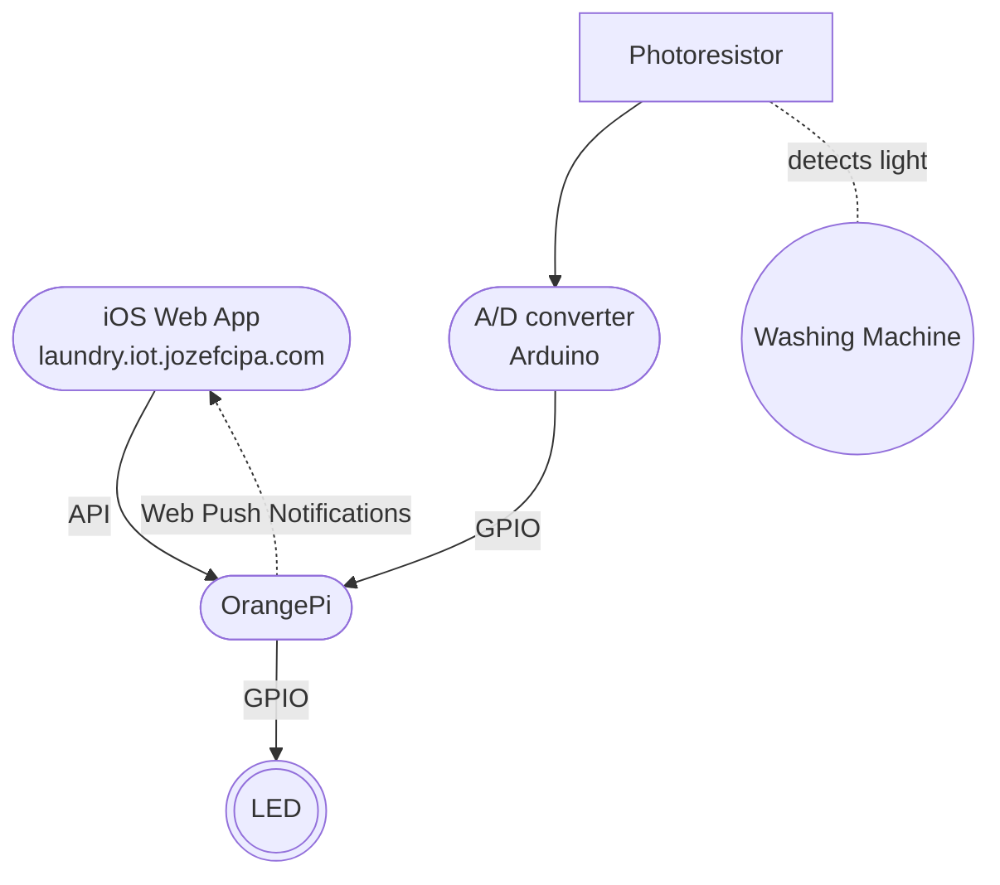

# Laundry Alert

> _A small IoT project that monitors your washing machine and sends a push notification when the washing cycle ends_
<br>


## How it works



The application consists of three parts

**PWA application**

A simple web application that is used to subscribe for notifications. It is installed on a phone as a web app.

Deployed at [laundry.iot.jozefcipa.com](https://laundry.iot.jozefcipa.com/).

See the [docs](./src/web/README.md).

**Control Unit**

This is where the main logic resides. It is an [OrangePi Zero](http://www.orangepi.org/html/hardWare/computerAndMicrocontrollers/details/Orange-Pi-Zero.html
) single-board computer running the Node.js app that communicates with the A/D converter, controls the status LED and sends push notifications to the web app.

Deployed at local network IP (e.g. `192.168.0.100:80`) behind the NGINX proxy.

See the [docs](./src/api/README.md).

**A/D converter**

[Seeeduino XIAO SAMD21](https://www.seeedstudio.com/Seeeduino-XIAO-Arduino-Microcontroller-SAMD21-Cortex-M0+-p-4426.html) is used here to perform a simple analog to digital conversion when reading the values from the photoresistor. This data is then processed by the Control unit.


See the [docs](./src/ad-converter/README.md).


## How to run
- TBD - write general information to set up the project locally

- set up web - TBD link to web docs
- set up api - TBD link to API docs
- deploy code to Seeduino (via Arduino IDE)


### Makefile - TBD
- list of commands


## Configuration

### OrangePi Configuration

#### Connecting to the unit
You can connect to OrangePi via SSH using the following credentials:

_User_: `root` <br>
_Password_: `orangepi`


#### Installation - TBD
- Install Node.js
- Install NPM dependencies (TBD - makefile command)
- Install [WiringOP](https://github.com/orangepi-xunlong/wiringOP) GPIO library
- Install Nginx - TBD makefile command
- Generate SSL certificates - TBD makefile command
  - don't forget to register the certificate in iOS (**TBD article**)
- Generate VAPID keys - TBD makefile command
- Copy code from the computer - TBD makefile command
- Register the program to start on startup - TBD makefile command

#### GPIO
GPIO stands for General Purpose Input Output bus and it's used to communicate with other devices.<br>
This project uses two pins - one for controlling led (16) and one for reading information from the A/D converter (6).


**Note**: Use the `wPi` column to refer to the correct pin number!


We can test whether the library is installed and working properly by trying to turn the LED on and off.

```bash
$ gpio readall       # show the GPIO configuration map
$ gpio mode 16 out   # this sets the GPIO PIN 16 (LED) as OUTPUT
$ gpio write 16 1    # turn on the LED
$ gpio write 16 0    # turn off the LED
```

### HTTPS and iOS - TBD
describe root certificate and how it needs to be added to iphone to support local HTTPS connection
as the device is running locally