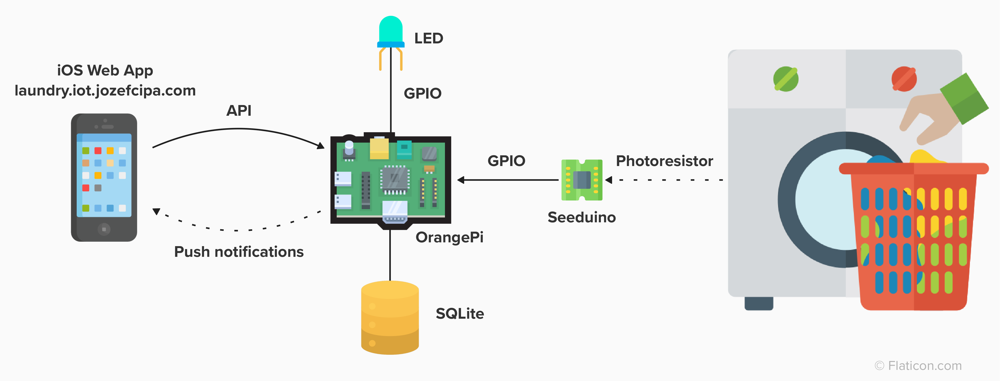

# Laundry Alert

> _A small IoT project that monitors your washing machine and sends a push notification when the washing cycle ends_
<br>


## How it works



The application consists of three parts

**iOS Web App**

A simple web application that is used to subscribe to notifications. It is installed on a phone as a web app.

Deployed at [laundry.iot.jozefcipa.com](https://laundry.iot.jozefcipa.com/).

See the [docs](./web/README.md).

**Raspberry Pi Zero 2W (RPi)**

This is where the main logic resides. It is a [Raspberry Pi Zero 2W](https://www.raspberrypi.com/products/raspberry-pi-zero-2-w/) single-board computer running the Node.js app that communicates with the A/D converter, controls the status LED, and sends push notifications to the web app.

Deployed at local network IP (e.g. `192.168.0.100:80`) behind the NGINX proxy.

See the [docs](./api/README.md).

**Seeduino (A/D converter)**

[Seeeduino XIAO SAMD21](https://www.seeedstudio.com/Seeeduino-XIAO-Arduino-Microcontroller-SAMD21-Cortex-M0+-p-4426.html) is used here to perform a simple analog to digital conversion when reading the values from the photoresistor. This data is then processed by the Control unit.

See the [docs](./ad-converter/README.md).

## Running locally
- Install dependencies - `make deps`
- Start the web - `make web`
- Start the API - `make api/dev` (**Note**: the API must be [configured first](./api/README.md))
- Deploy the code to Seeduino (via Arduino IDE)

### Makefile
- `deps` - Download production + development NPM dependencies
- `deps/prod` - Download production NPM dependencies
- `api/prod` - Start the API with `NODE_ENV=production`
- `api/register-launcher` - Register pm2 startup launcher so the API will start automatically after reboot
- `api/dev` - Run API locally
- `api/init-db` - Initialize SQLite database
- `web` - Serve web client application locally
- `deploy` - Copy the files from the local computer to RPi
- `ssl/certificate-manager` - Saves the next SSL certificate renewal date and generates the certificate if needed
- `nginx/setup` - Configure NGINX server (needs to be run with `sudo`. Also, make sure to remove the default NGINX page as it listens on port 80)
- `gpio/test` - Test whether GPIO works by blinking the LED

## RPi Configuration

### Connecting to the unit
You can connect to RPi via SSH (password `laundry`)

```bash
$ ssh laundryalert@192.168.0.100
```

### Prerequisites

Make sure to have `mkcert` [downloaded](https://github.com/FiloSottile/mkcert) locally on your computer and generate the root CA authority first! (`mkcert -install`)

### Installation

- Install Node.js
- Install Nginx
- Install [WiringPi](https://github.com/WiringPi/WiringPi) GPIO library
- Generate VAPID keys (See [API configuration](./api/README.md))
- Copy code from the computer - `make deploy`
- Install NPM dependencies (`sudo make deps/prod`, use `sudo` to install `pm2` globally). It might take a while, just be patient 😅
- Copy `.env.example` to `.env` in `./api/src` and configure the values
- Initialize the database - `make api/init-db`
- Start the API - `make api/prod`
- Register the API to start after booting - `make api/register-launcher`
  - **Run** the command provided in the output
- Generate SSL certificates - `make ssl/certificate-manager`
- Run `cat .crontab | crontab -` to make sure `ssl/certificate-manager` is run automatically after reboot
- Configure Nginx - `sudo make nginx/setup`
- Open `192.168.0.100` in your browser. If everything went well, you should see a response from the API.

### GPIO
GPIO stands for General Purpose Input Output bus, and it's used to communicate with other devices.<br>
This project uses two pins - one for controlling the LED (29) and one for reading information from the A/D converter (15).


**Note**: Use the `wPi` column (`$ gpio readall`) to refer to the correct pin number!

We can test whether the library is installed and working properly by trying to turn the LED on and off.

```bash
$ gpio readall       # show the GPIO configuration map
$ gpio mode 29 out   # set the GPIO pin 29 (LED) as OUTPUT
$ gpio write 29 1    # turn on the LED
$ gpio write 29 0    # turn off the LED
```

There is also a Makefile command `make gpio/test` that does the same.

## HTTPS and iOS

As the app is using a self-managed SSL certificate for the API, we need to register it in our iOS (Android) device to allow connections. <br>
To do so, we need to add the SSL root authority certificate to our phone. <br>
Read more [here](https://jozefcipa.com/blog/self-signed-ssl-certificates-on-ios) to see how to configure it.
