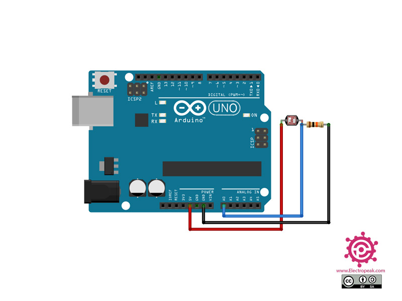

# AD converter

As OrangePi (or RaspberryPi) GPIO doesn't have analog pins, we have to include A/D converter to transform the analog data from the photoresistor to the digital 0/1.

As the first attempt I tried to use the [MCP3002 chip](https://www.microchip.com/en-us/product/mcp3002) but due to my miserable knowledge of electronics (or faulty SPI setup) I was unable to make it work.

Therefore, I decided to replace it with a cheap [Seeeduino-XIAO](https://wiki.seeedstudio.com/Seeeduino-XIAO/) board that is similar to Arduino and simply achieved the necessary logic by programming it (After all, I'm a software engineer 😁).

The board receives an analog input from the photoresistor and based on the given value (0-1023) it returns either a 0 or 1. This output is then connected to the digital input pin of OrangePi that further processes the signal.

### Circuit diagram

[Source](https://electropeak.com/learn/interfacing-photoresistor-ldr-sensor-with-arduino/)

